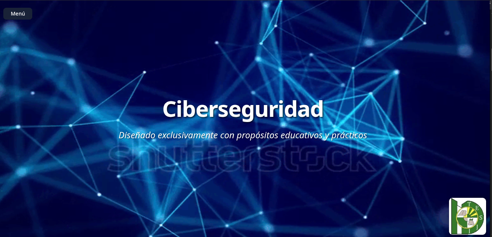
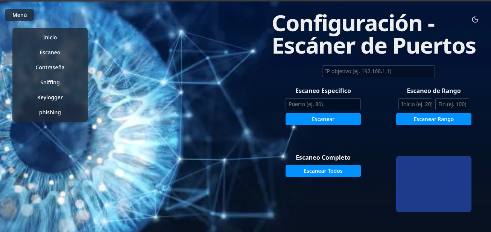
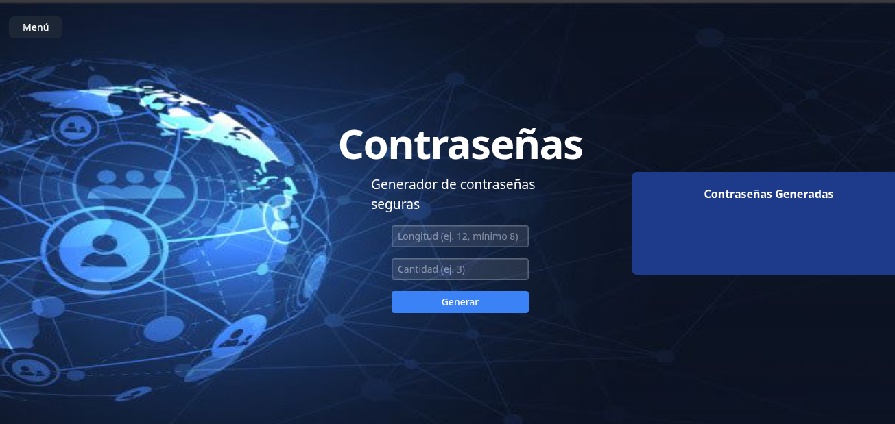
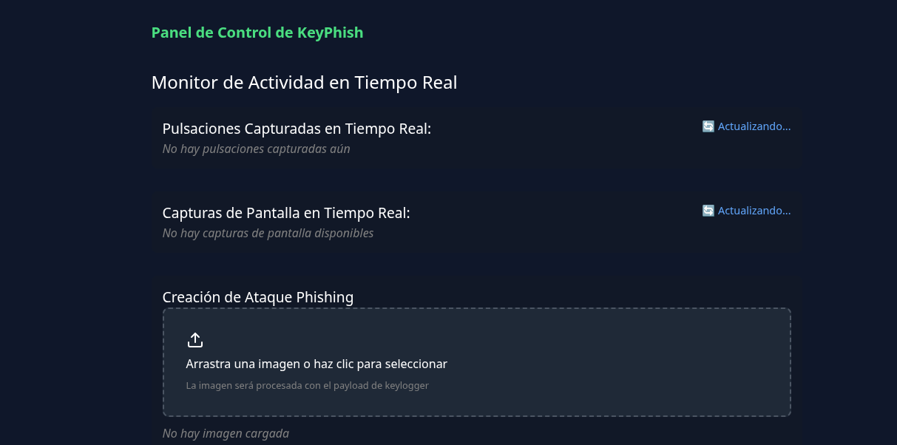

# 🛡️ CyberLab - Plataforma de Ciberseguridad Educativa

[](https://python.org)
[](https://fastapi.tiangolo.com/)
[](https://reflex.dev/)
[](LICENSE)

## 📋 Descripción

**CyberLab** es una aplicación web de ciberseguridad desarrollada con **Reflex** y **FastAPI**, orientada a fines **educativos y prácticos**.  
Incluye diversas herramientas para demostrar técnicas de seguridad ofensiva y defensiva en un **entorno controlado**.  

⚠️ **Advertencia:** Este proyecto es solo para **aprendizaje y pruebas** en entornos controlados. **No lo uses en sistemas o redes sin autorización.**

## 🖼️ Vista del Proyecto

### 📌 Menú Principal


### 🔍 Escaneo de Puertos


### 🔑 Generador de Contraseñas


### ⌨️ Keylogger y Capturas


---

## ✨ Funcionalidades

- 🔍 **Escaneo de Puertos**:  
  Escanea puertos específicos, rangos o todos los puertos de una IP objetivo usando **Nmap**, mostrando resultados en tiempo real.

- 🔑 **Generador de Contraseñas**:  
  Crea contraseñas seguras, evalúa su fortaleza y muestra la validación en la interfaz.

- ⌨️ **Keylogger & Screenshots**:  
  Captura pulsaciones de teclas y realiza capturas de pantalla periódicas en la máquina víctima, enviándolas al servidor para visualización y descarga.

- 🎭 **Phishing**:  
  Incrusta scripts en imágenes y genera enlaces personalizados para simular ataques en un entorno controlado.

- 📊 **Panel de Control Web**:  
  Interfaz web moderna y responsiva para manejar todas las funciones y visualizar resultados.

- ⚙️ **API REST**:  
  Endpoints para interactuar con el keylogger, capturas, descargas y gestión de estado.

- 🗂️ **Gestión de Archivos Estáticos**:  
  Servidor de imágenes, capturas y otros recursos.

---

## 🛠️ Tecnologías Utilizadas

- **Backend**
  - Python 3.10+
  - FastAPI
  - Scapy
  - python-nmap
  - Pydantic

- **Frontend**
  - Reflex (para la UI web)
  - JavaScript/HTML integrados en componentes Reflex

- **Dependencias extra**
  - netifaces
  - stepic
  - pillow
  - pynput

---

## 📁 Estructura del Proyecto

```
cyberlab/
├── .web/                    # Directorio de Reflex (se elimina al reinstalar node_modules)
├── assets/                  # Recursos estáticos (imágenes, capturas, etc.)
├── cyberlab/               # Código principal
│   ├── state.py            # Clase principal con el estado global
│   ├── api.py              # Endpoints de FastAPI
│   ├── pages/              # Páginas y componentes Reflex
│   └── utils/              # Funciones auxiliares
├── requirements.txt         # Dependencias
└── README.md               # Este archivo
```

---

## 🚀 Instalación Rápida

### 1️⃣ Clona el repositorio
```bash
git clone https://github.com/usuario/cyberlab.git
cd cyberlab
```

### 2️⃣ Crea un entorno virtual
```bash
python -m venv venv
source venv/bin/activate   # Linux/Mac
venv\Scripts\activate      # Windows
```

### 3️⃣ Instala dependencias
```bash
pip install reflex python-nmap netifaces stepic pillow pynput scapy fastapi pydantic
```

### 4️⃣ Reinstala Reflex Web (si es necesario)
```bash
rm -rf .web
```

### 5️⃣ Inicia la aplicación
```bash
reflex run
```

### 6️⃣ Abre la interfaz
Accede desde tu navegador:
👉 **http://localhost:3000**

---

## ⚡ Uso

1. Entra al **menú principal** y selecciona la herramienta.

2. Configura el **escaneo de puertos**, genera **contraseñas** o lanza módulos como el **keylogger**.

3. Visualiza los **resultados** directamente en la interfaz web.

4. Administra las **simulaciones** desde el panel de control.

---

## 🔧 Solución de Problemas

### Error al iniciar Reflex
```bash
rm -rf .web
reflex run
```

### Dependencias no encontradas
Verifica que estás dentro del entorno virtual y reinstala:

```bash
pip install -r requirements.txt
```

---

## 🤝 Contribuir

1. Haz **fork** del repo
2. Crea una nueva rama (`git checkout -b feature/nueva-funcionalidad`)
3. Realiza cambios siguiendo buenas prácticas de Python (**PEP8**)
4. **Commit** con mensajes claros
5. Abre un **Pull Request** 🚀

---

## 🙏 Agradecimientos

- A la comunidad de **Python** y **FastAPI** por sus herramientas.
- A los proyectos de **ciberseguridad educativa** que inspiran este trabajo.
- A todos los que contribuyen al **código abierto** ❤️
